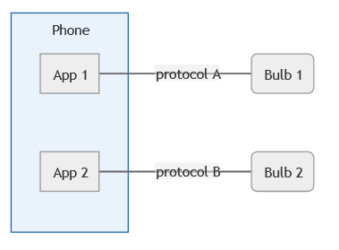
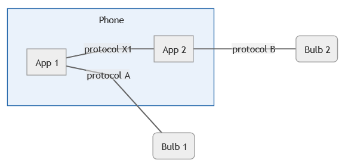

# Conceptual Framework

This section explains the ideas behind the Knowledge Engine.

## Knowledge Base
A knowledge base is an independent producer or consumer of information.

Many things can be a knowledge base, for example:

- A database
- A weather station
- A smartphone app
- A heart-rate monitor
- A machine learning model

Individually, a knowledge base could be interesting and useful.
However, much power lies in *combining* several of these knowledge bases (explained in [the next section](#knowledge-network)).

An important assumption that we make is that a knowledge base can be sufficiently described in terms of the knowledge that it processes.
This means that we can describe what kind of knowledge can be extracted from this base and what kind of knowledge this base is interested in, and that we capture this well enough to provide synergy to the network.
In other words, we assume that we can make a description of the knowledge base that captures its knowledge input and output ([knowledge Interaction](#knowledge-interaction)): What knowledge does it provide? What knowledge does it require?
Furthermore, we assume that we capture the knowledge interactions of a knowledge base well enough that it can be exploited or satisfied by *other* knowledge bases.

It is important to note that knowledge bases aren't limited to being *just* producers or consumers of information; they could trigger **side effects**, and thus play a role in control systems such as heating systems or artificial cardiac pacemakers.

Humans can play a vital role in a knowledge base.
A knowledge base with **humans in the loop** could, for example, use a smartphone app that asks a human for input on a decision.

## Knowledge Network

> Knowledge is only real when shared.

(Adapted from a quote in the motion picture *Into the Wild* (2007): *"Happiness is only real when shared"*.)

<!-- TODO: Maybe also tell how it is less flexible to have a hard link from Service A to Service B, than it is to have a soft link (via the Knowledge they consume/produce) between Service A and Service B, because then Service C can also tune in. -->

As hinted to above, several knowledge bases that *share* knowledge provide more value than the same knowledge bases that are siloed: The whole is greater than the sum of the parts.

Therefore, it makes sense to talk about a set of such knowledge bases that share knowledge: A *knowledge network* is a set of knowledge bases that exchange knowledge about a clearly defined domain.

### Example: Home automation
Imagine someone installing a smart light bulb because they want the comfort of toggling the light from their phone.
They enjoy this novelty, and after a few weeks decide to buy another light bulb: this time from a different manufacturer.

To their surprise, it is now necessary to install another app!
(Granted: These devices are often compatible with most phones on the operating system level, but also on that level the compatibility with a multitude of standards can be considered inconvenient.)

In the example above, there were three physical devices: The phone and the two light bulbs.
However, the phone contained two 'knowledge bases' and the knowledge for both light bulb systems was completely siloed:



It would be convenient if the silos exchanged information, or better, if there was a single generic app that can communicate with both bulbs:



Because of these obvious advantages, combining knowledge bases like this is becoming increasingly common.
Currently, these combinations are often hand-made, and it would be convenient to make this easier.

However, we can imagine that this will not scale when many more devices from different manufacturers are added: we don't want to require every manufacturer's app to support every other manufacturer's app.
To solve this, we will explain in [the next section](#smart-connector) how *smart connectors* conveniently allow the use of an open knowledge model that enables a knowledge base to be interoperable with other knowledge bases in a domain, and additionaly provide extra benefits.

## Smart Connector

In the previous section, we established that it is advantageous to connect a knowledge base to a knowledge network, and that it is convenient if it is easy to make this connection.

This is solved by smart connectors.
A smart connector is an entity (currently in the form of a Java object) that allows a knowledge base to register with the knowledge network, and exchange knowledge with it.
It represents the knowledge base within the knowledge network, and acts on its behalf.

In the registration phase, the knowledge base has to specify how it wants to exchange what knowledge (the [knowledge Interaction](#knowledge-interaction)):

- What knowledge can be requested from me?
- What knowledge will I publish to the network?
- What knowledge will I request from the network?
- To which knowledge will I subscribe?

For example, a temperature sensor might regularly publish temperature measurements to the network, and will respond to requests for the current temperature.
A thermostat app might subscribe to knowledge about temperature measurements in a room, or request the current temperature.
It might also publish current temperature preferences of a user.
A heating system might subscribe to both the knowledge about temperature preferences and temperature measurements to be able to optimally control the temperature.

In the exchange phase, knowledge is consumed, produced, or published by the knowledge base in the handlers that were configured during the registration phase.

A requirement for being able to use smart connectors in a domain is that all knowledge bases need to agree on a common language to exchange their knowledge in.
This language is different for every domain.
(In the thermostat example above, this language should include concepts like measurements, temperature, and preferences.)
In the knowledge engine, this language can be expressed in the form of an ontology or knowledge model, which is explained further in [a following section](#knowledge-model).

The domain's knowledge model is written in RDF/OWL, which allows us to take advantage of the reasoning capabilities that are available for these models.

Since the knowledge engine internally knows about the supply and demand of knowledge in the network, it can use reasoning to orchestrate of knowledge supply on-demand.

Critically, this means that, given a specification of knowledge that is requested, a smart connector **can figure out for you where to get it**!
The developer of a knowledge base doesn't have to know or care about the specifics of all other knowledge bases.
They can simply ask the smart connector for some knowledge, and if possible it will orchestrate other knowledge bases (through their smart connectors) to produce the response.

The main advantages of using smart connectors are:

- Knowledge orchestration removes the need to implement compatibility to between all pairs of knowledge bases in the network by hand.
- Changes in the knowledge network are handled seamlessly by synchronizing information about knowledge interactions.
- Established open-source Semantic Web technologies are leveraged to provide knowledge models and reasoning capabilities.

## Dynamic knowledge network

As long as the smart connectors are aware of changes in the network, new knowledge bases can be dynamically added to the network.

Information about the [knowledge Interactions](#knowledge-interaction) of smart connectors is synchronized by using a [*knowledge directory*](#knowledge-directory), explained [further on](#knowledge-directory).

For example, we could add a smart curtain to the hypothetical home automation knowledge network that automatically closes the curtains when the lights in the same room are turned on after sunset.

## Knowledge Model

The knowledge model (or ontology) describes the concepts and relations between these concepts that are necessary to describe the universe of discourse.
It defines the 'language' in which knowledge is exchanged.

The knowledge model is built using semantic web technologies: [RDF](https://www.w3.org/TR/rdf11-primer/) is the underlying data model, and [OWL](https://www.w3.org/TR/owl2-overview/) (which is itself built on RDF) is the language that is used to describe the knowledge model.

In the running example, the necessary concepts for the knowledge model are for example:

- Light source
- User preference
- User
- Room

For the knowledge exchange to work, and to take full advantage of the platform, these concepts and relations between them should be formalized in detail in the knowledge model.

An example of such a knowledge model is the [SAREF ontology](https://ontology.tno.nl/saref/).

## Knowledge Interaction

A *knowledge interaction* is a description of what type of messages a knowledge base produces (or consumes).
A knowledge base can have multiple knowledge interactions.
One knowledge interaction describes a single capability of a knowledge base.

There are four types of knowledge interactions:

- __ASK__: A graph pattern that describes the 'shape' of knowledge that the smart connector will request from the network.
- __ANSWER__: A graph pattern that describes the 'shape' of knowledge that the smart connector can provide the network with.
- __POST__: Whenever this knowledge base decides, it posts knowledge in the form of the argument graph pattern and expects (optional) knowledge in the form of the result graph pattern.
- __REACT__: Whenever a smart connector receives the request from the network, it allows the Knowledge Base to react to the knowledge conforming to the argument graph pattern and send knowledge back to the Knowledge Network in the form of the resultgraph patterns.

For example, the POST Knowledge Interaction of a temperature sensor is:

- argument:
```sparql
?obs rdf:type sosa:Observation . 
?obs sosa:hasFeatureOfInterest ?room_id . 
?obs sosa:observedProperty saref:Temperature . 
?obs sosa:hasSimpleResult ?temp .
?room_id rdf:type saref:Room . 
?room_id saref:hasName ?room . 
```

- result: `<empty>` 

The argument graph pattern is expressed as a [SPARQL graph pattern](https://www.w3.org/TR/rdf-sparql-query/#BasicGraphPatterns).
This particular pattern describes observations of temperature measurements in a room.
It should be noted that some variables (the resources/literals with prefix "`?`") will not vary much for a single static temperature sensor.
For example, the `?room` and its `?room_id` will probably always be bound to the same value.
The result, `?temp` will vary more.

ANSWER knowledge interactions offer their (historic) data to be requested on demand, whereas POST knowledge interactions will publish new knowledge when it comes available.
The simple temperature sensor in the example is unable to store much data, so it makes more sense to publish measurement (with a POST interaction) and then forget them.

## Knowledge Directory

*Note: Developers using smart connectors do not need to know about the knowledge directory since the communication and synchronization is handled by the smart connectors internally.*

Since all smart connectors need to know about each other to exchange knowledge, they need a way to know of each other.
The current solution implements this with a centralized knowledge directory.
The knowledge directory is aware of all smart connectors and their knowledge Interactions.

## Rules

<!-- TODO: Is information like this necessary for developers using smart connectors? They don't need to write rules, or do they? -->

An if-then statement that tells the reasoner how to derive inferred facts from asserted facts. There are many forms of reasoning, but backward reasoning and forward reasoning are the typical ones. Backward reasoning means reasoning to prove a certain statement (i.e. question). This is also called goal-based reasoning, because you reason towards a particular goal (or actually, from a goal backwards to the actual data). Forward reasoning is also called data-driven reasoning, because it starts from the data and tries to infer all possible facts from this data using the available rules.

## Mathematical framework

The aim is to make a mathematical description of this framework, but for that we first need to stabilize our vision.
