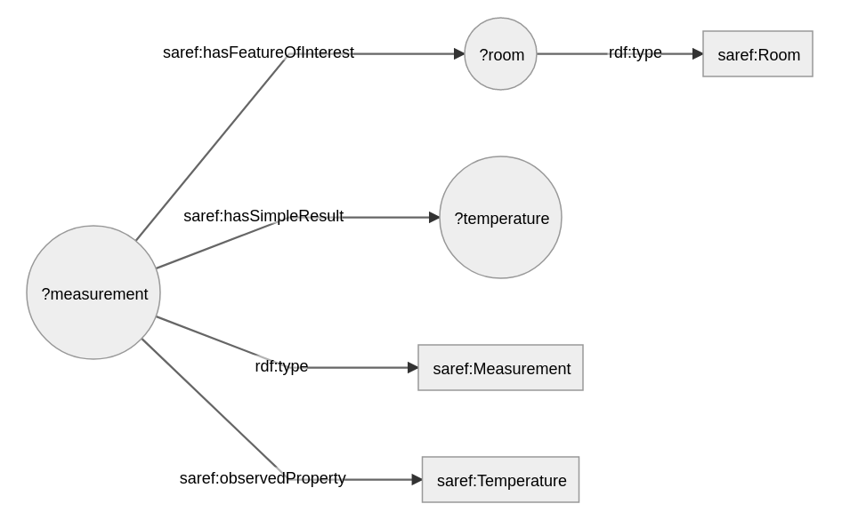

# Java Developer API

As a developer, you might be thinking "this all seems awfully complex and painful".
If that sounds like you, we have good news: you don't have to bother with most of it!

This section explains the Java Developer API of the Knowledge Engine. The requirements of the Knowledge Engine are described in Test Cases and can be found [here](./04_test_cases.md).

Note that there is also a [REST Developer API](https://gitlab.inesctec.pt/interconnect/knowledge-engine/-/blob/master/rest-api/src/main/resources/openapi-sc.yaml) available.

We provide an implementation of a `SmartConnector` that you can instantiate as a Java object.
You are responsible for:

- Registering the knowledge that your knowledge base requests or provides.
- Implementing handlers that are called when certain knowledge is requested or provided.

<!-- TODO: Add instructions on how to use it in a Maven project once that's possible. (Also how to include it as a jar?) -->

The SmartConnector uses this to register itself in the knowledge network.
The following subsections further explain how a SmartConnector can be instantiated and, how the different kinds of knowledge can be registered.

## Instantiating and configuring a SmartConnector

<!-- TODO: Show how to instantiate a `SmartConnector`, and explain that it needs network ports. -->

Assuming `this` is your knowledge base, you can make a `SmartConnector` as follows:

```java
SmartConnector sc = SmartConnectorBuilder.newSmartConnector(this).create();
```

## Registering and using Knowledge Interactions
Currently, a SmartConnector is required to register the patterns of knowledge that it will request from the network. (See #67)

A knowledge request can be registered as follows:
```java
AskKnowledgeInteraction asksForTemperatureMeasurements = new AskKnowledgeInteraction(graphPattern);
sc.register(
    asksForTemperatureMeasurements
);
```
where `graphPattern` is a string describing an RDF graph pattern where variables are prefixed with a `?`.

Graph patterns consist of one or more triples separated by a dot (.) and each triple consists of a subject, predicate and object node. Each node can be either a variable (using a question mark ?var prefix), a URI (using the <https://...> or a literal (using quotes "hello").
More information on graph patterns can be found in:
- the Knowledge Engine documentation: https://gitlab.inesctec.pt/interconnect/knowledge-engine/-/blob/master/docs/03_java_developer_api.md
- this presentation (from slide 16 onwards): https://drive.inesctec.pt/f/16079670

As an example, assume `graphPattern` is the following graph pattern:
```sparql
?measurement rdf:type saref:Measurement .
?measurement saref:hasFeatureOfInterest ?room .
?room rdf:type saref:Room .
?measurement saref:observedProperty saref:Temperature .
?measurement saref:hasSimpleResult ?temperature .
```
It can be illustrated with this diagram:


where the variables are represented by circles and the fixed URIs are represented by rectangles.

The graph pattern above matches on temperature measurements in rooms.

### Querying the network

When querying the network for the pattern, the variables (`?measurement`, `?room`, and `?temperature`) can be bound to known values, to limit the possible matches.

For example, if we know that there's a room called `https://www.example.org/kitchen`, we can set up the bindings as such:
```java
Set<Binding> queryBindings = new HashSet<Binding>();
queryBindings.add(new Binding(new String\[][] {{ "room", "<https://www.example.org/kitchen>" }}));
```
and subsequently query for matches:
```java
AskResult askResult = sc.ask(asksForTemperatureMeasurements, queryBindings).get();

BindingSet resultBindings = askResult.getBindings();
```
The results from the knowledge network are in the set of bindings.
The `AskResult` contains other useful information, such as `AskExchangeInfo`, which gives information about the data's origins.

## Registering and using other kinds of Knowledge Interactions

Aside from `ASK` knowledge interactions, there are also `ANSWER`, `REACT`, and `POST` interactions, which will be explained here in the future.
## Bindings

The data that is shared is inside the `Binding` objects.
A `Binding` object describes a 'match' of a graph pattern.

For the graph pattern above, an example binding might be:

```
measurement --> <https://www.example.org/measurement-42>
room --> <https://www.example.org/kitchen>
temperature --> "21.2"^^<http://www.w3.org/2001/XMLSchema#float>
```

As you can see, a `Binding` object is essentially a map from variable names to the values that they're bound to in the real world.

Two important things should be noted:

1. The keys of the bindings MUST correspond to the variable names in the graph pattern, and they must be complete (all variables must have a value bound to them). (This last restriction does not apply to the bindings given with ASK requests; they can be partial of even empty.)
2. The values of the bindings MUST be valid IRIs (https://www.w3.org/TR/turtle/#sec-iri) (for now without prefixes, so full IRIs) or valid literals (https://www.w3.org/TR/turtle/#literals).

### Binding sets

A result of a knowledge interaction can have more than 1 match. These matches are collected in a `BindingSet`, which is simply a set of bindings.

### Hierarchy example

Imagine your graph pattern looks something like this (note that we use a non existing ontology):

```
?ts rdf:type ex:TimeSeries .
?ts ex:hasUnitOfValue ?unit .
?ts ex:hasMeasurement ?meas .
?meas ex:hasTimestamp ?timestamp .
?meas ex:hasValue ?value .
```

Imagine you have JSON data of the form:

```json
{
	"unit": "degrees celcius",
	"measurements": [
		{
			"timestamp": "2021-04-29T12:00:00Z",
			"value": "22.8"
		},
		{
			"timestamp": "2021-04-29T12:00:00Z",
			"value": "20.8"
		}
	]
}
```

How would the bindingset look like that represents the JSON corresponding to the graph pattern?

```json
[
	{
		"ts": "<https://www.interconnectproject.eu/example/timeseries1>",
		"unit": "<https://www.interconnectproject.eu/example/degreesCelcius>",
		"meas": "<https://www.interconnectproject.eu/example/timeseries1/measurement1>",
		"timestamp": "\"2021-04-29T12:00:00Z\"^^<http://www.w3.org/2001/XMLSchema#dateTime>",
		"value": "\"22.8\"^^<http://www.w3.org/2001/XMLSchema#double>"
	},
	{
		"ts": "<https://www.interconnectproject.eu/example/timeseries1>",
		"unit": "<https://www.interconnectproject.eu/example/degreesCelcius>",
		"meas": "<https://www.interconnectproject.eu/example/timeseries1/measurement2>",
		"timestamp": "\"2021-04-29T13:00:00Z\"^^<http://www.w3.org/2001/XMLSchema#dateTime>",
		"value": "\"20.8\"^^<http://www.w3.org/2001/XMLSchema#double>"
	}
]
```

Note the following:
- the `meas` variable in the first array element is called `measurement1` and in the second array element it is called `measurement2`.
- the value of the `ts` variable in the first array element is the same as the `ts` variable in the second array element.
- both values of the `timestamp` and `value` variable have this structure `"..."^^<...>`, where the first `...` contains the actual value and the second `...` contains the type of this value.
- quotes in the values need to be escaped using a `\`.
